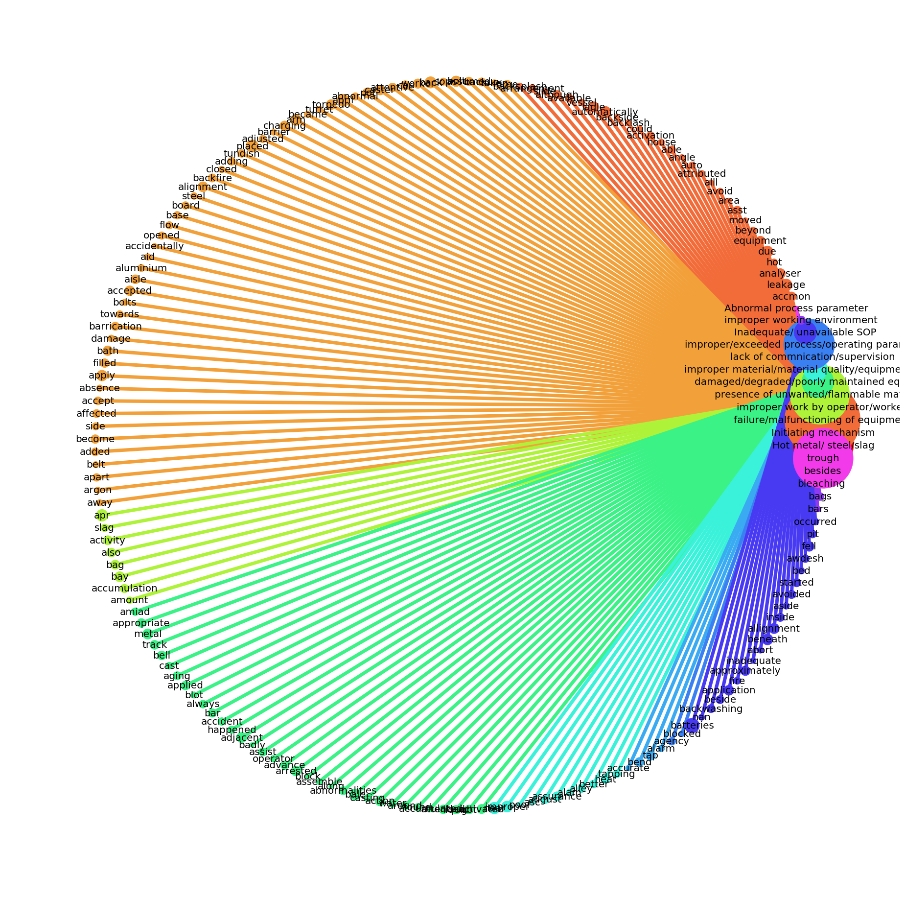

# Concept-Map
Make a Knowledge Graph using NLP and python visualizing library networkx.

Results of Concept Map:

1. Visualization between topic and concepts:
 

2. Concept-Map in spring form for first output:
 

3. Concept-Map in spring form for Second output:
 
 
4. Concept-Map in Random form:
 

5. Concept-Map in Circular form:
 
